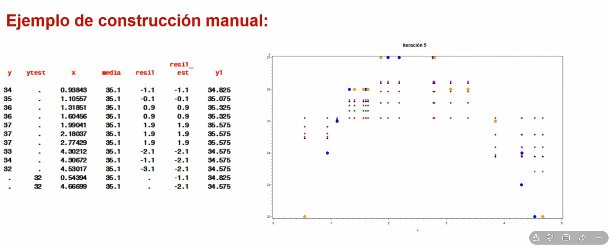

# Gradient boosting

Funciona añadiendo secuencialmente predictores a un conjunto y cada uno de ellos corrige los errores de su predecesor. ESte modelo se entrena con los errores residuales del predictor anterior

SE basa en ir actualizandolas predicciones en la direccion de decrecimiento dada por el negativo del gradiente, de la funcion de error L(Yi,F(Xi)) donde Yi es la etiqueta real y F(Xi) el valor predicho por el modelo.

La actualizacion de las predicciones se realiza en direccion de decrecimiento de la funcion de error

IDEA: buscar la pendiente de crecimiento

NOta: tanto el gradient boosting como el xgboost son modelos sin ninguna explicanilidad, totalmente caja negra.
Consejo: usarlos solo cuando la ganancia en eficacia sea muy significativa.
Cuanod se pierde la idea intuitiva del origen de una ineficiencia, es muy dificil resolver los probelmas.

EN cada iteracion se calcula la pendiente
EN cada arbol calculo los parametros que lo mejorarian y actualizo

1. COmenzar con un modelo inicial simple, como con un solo arbol de decision
2. Calcularlas predicciones iniciales y los errores residuales
3. Ajustar un nuevo modelo para predecir estos errores residuales. ESte nuevo modelo se agrega al modelo existente, corrigiendo los errores
4. REpetir los pasos 2 y 3 iterativamente, para mejorar el modelo en cada paso. Cada nuevo modelo se enfoca en corregirlos errores restantes del conjunto anterior.

Entonces, basicamente, en problemas de regresion, el algoritmo gradietn boosting consiste en modificar las predicciones en la direccion de decrecimiento del gradiente (en este caso el residuo).

Si el residuo sale negativo en una observacion (estamos prediciendo valores mas altos que la realidad), se actualiza la predccion en la direccion  de decredimiento, es decir, se reduce el valor predicho.

NOTA: Gradietn boosting se suele usar con arboles, pero no es mas que un tipo de ensamblado que se podría aplicar en cualquier modelo

OJO: A diferencia del bagging/random forest, gradient boosting no calcula un monton de arboles y despueslos agrega, sino que, para cada arbol construido, analiza como se ha equivocado y trata de aliviar el error de cara a la construccion del siguiente: cada arbol es una mejora del anterior. EL ultimoa rbol no es la agregacion de todos sino el ultimo de ellos

## Algoritmo gradient boosting para regresion

1. Dar como valor predictivo de la variabley para cada observacion la media de los valores de la variable y. ESte sera el punto de partida, y en cada iteracion del algoritmo la prediccion de y para cada observacion sera actrualizada de manera individual

2. REpetir los siguientes pasos para cada iteracion m:
    i calcular el residuo actual
    ii construir un arbol de regresion para predecirlos residuos, tomando ri^m como variable dependiente, yel conjunto de variables X inputo como independientes. ESto nos datra como resultado un residuo predicho que no es exactamente igual que el real pero nos sirve para actualizar las observaciones test para las que no hay residuo real al no haber y
    iii Actualizar la prediccion de ypara cada observacion (incluidas las observaciones d elos datos test) en la direccion de decrecimiento

3. EL proceso se detiene cuando se llega al numero de iteraciones final deseado
    - es conveniente señalar que los datos train convergenal verdadero valor de la y, asi que no se debe tomar en ningun caso como referencia la performance del gradient boosting sobre adtos train, sino solamente sobre datos test.

## Algoritmo gradient boosting para clasificacion

1. SE toma como valor inicialpara la probabilidad predichar de 1 en todaslas observaciones el porcentaje 1 de la muestra
2. REpetir los siguientes pasos para cada iteracion de m:
    i: Calcular el residuo actual
    ii: COnstruir un arbol de regresion para predecir los residuos, tomando ri^m como variable dependiente u objetivo, y el conjuntode las variables X input como dependientes
    iii: Actualizar la prediccion de la funcion logit f para cada observacion
    iv: actualizar las prediciones de las probabilidades

3. EL proceso se detiene cuando se llega al numero de iteracioines final deseado

### Ejemplo de construccion manual

1. EN la primera iteracion (puntos pequeños color rojo en el grafico) se fijanlos valores iniciales de las predcciones de la variable y como su media (35.1), para todas sus observaciones
2. SE calcula el residuo real (resi1) que para la primera observacion train toma calor -1.1 y para las observaciones test no existe y al no existir la y
3. SE construye un arbold e regresion, con resi1 como variable objetivo, x como variable input. ESto da una prediccion para resi1(resi1_est) que no es exactamente igual que resi1: en la observacion train n9 resi1 toma el valor -1.1 y su prediccion-2.1; ademáslas observaciones test tienen valor predicho resi1_est, al disponer de la variable predictora x.
4. SE actualiza la prediccion de y(y1). En la pimera observacion train, de predecir 35.1, se ha reducido la prediccion en la buena direccion a 34.825; en las observaciones test se ha pasado a 34.825 y 34.575. EN el gráficoaparece en color verde la prediccion final de esta primera iteracion
5. El proceso continua: se calculan los residuos, se predicirian, se actualizaria la y en cada iteracion. SE observa como las observaciones realies train (puntos grandes azules) tienden a clavarperfectamente su prediccionpero las observaciones reales test (puntos grandes naranjas) que son la que importan, tambien se predice bastante bien. La quinta iteracion está representadapor los puntos pequeños rosa.

## Parametros a modificar para gradient boosting

- L aoncstante de regularizacion v (shink). Normalmente entre (0.00001 y 0.2). Cuanto mas alta, mas rapido converge, pero demasiado alta es poco preciso.- SI se pone muy baja (la recomendacion  teorica) hay que poner muchas iteracionespara que converja. EN la práctiva se comienza con valores altos para observar resultados básicos y cuando se controla bien el proceso el modelo final se realiza con valores bajos de v y muchas iteraciones.
- EL numero final de iteraciones-arboles M. A menos v, seran necesarias masiteraciones M. Es un parametro a monitorizar (con validacion cruzada y graficos preferentemente) pues teoria y practica coinciden en que a paritr de un punto se puede producir sobreajuste
- caracteristicas de los arboles:
    - Criterio de particion (entriopia, gini, varianza,...)
    - El numero de observaciones minimo en una rama-nodo
    - EL minimo tamaño apra dividir
    - Profundidad maxima del arbol
    -Parametro de complejidad
    - Otros(numero maximo de divisiones por nodo,...)

(prueba en python)