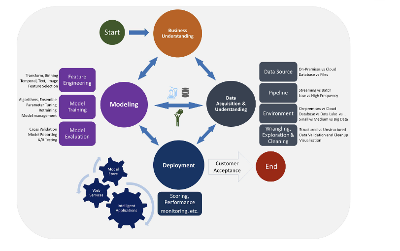

# Introduccion

## TIpos de problemas

- Aprendizaje supervisado:
    - Problemas de clasficiacion: cuando la variable objetivo es categorica
    - Problemas de regresion: cuando la variable objetivo es numérica

- APrendizaje no supervisado:
    - CLusterización: Cuando no hya variable objetivo

## Ciclo de vida de data science

## Porcesamiento de modelo

Para hacer un buen modelo ML, tenemos que:
1. Decidir cuáles serán las variables predictoras y la variable objetivo. Pero por el camino tenemos que (si fuese encesario):
    - Limpiar datos
    - Transformar algunas variables

2. Probar diferentes algoritmos predictivos, teniendo en cuenta que existen:
    - Diferentes parametrizaciones de cada modelo
    - Diferentes formas de entrenar un modelo
    - Diferentes métricas de evaluacion de un modelo
    