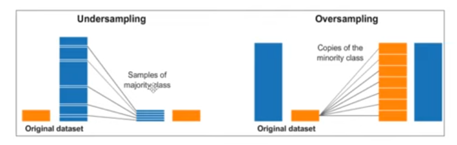

# imbalanced data

## el problema

Un conjunto de datos está desbalanceado cuando las clases (o etiquetas) no están representadas de manera igualitaria.
Potenciales impactos:
    - Si un modelo se entrena en un conjunto de datos desbalanceado, puede desarrollar un sesgo hacia la calse mas representada
    - Las métricas de rendimiento estandar como el accuracy pueden no reflejar el verdadero rendimientodel modelo en un conjunto de datos desbalanceado
    - Los algoritmos puden tener dificultades para aprender patrones de la clase minoritaria debido a la falta de ejemplos

## casos de uso

- DEteccion de fraudes financieros
- Diagnostico medico
- DEteccion de spam
- MOdelos de abandono (chum)
- modelos de venta cruzada (cross-selling, up-selling)
- DEteccion de anomalias
- Prosnostico de demanda de productos poco comunes
- DEteccionde actividades terroristas en datos de inteligencia
- desastres naturales
- DEteccion de plagios

## posibles soluciones

EN python podemos utilizar la libreria de imbalanced-learn donde se proponen distintos algoritmos que ayudan a entrenar modelos para reducir los problemas descritos.
Potenciales estrategias:
- stratification
- random over sampling
- random under sampling
- smote
- algortimos preparados para datos desbalanceados
- Algoritmos clasicos, pero que permite establecer pesos a las variables en funcion de la target

## estrategias

### estrartificacion

podemos entrenar un modelo con las sigueintes caractersiticas:
- train-test split que contenga el argunment stratiufy
- cv de tipo stratifiedkfolds
- metrica prohibida: accuracy
- metricas recomendbles:
    - precision
    - recall
    - f1

### over and undersampling

- Implica incrementar el número de instancias de la clase menos representada
- UNder amplingconsiste en reducir el número de instancias de la clase mayoritaria

### SMOTE

ES una técnica de over-sampling
Trata de equilibrar la distribucion de clases cuando ejemplos sinteticos, en lugar de simplemente duplicar los existentes

1. SEleccion de muestras: smote selecciona una muestra aleatoria de la clase minoritaria
2. Encontrar vecinosmas cercanos: ENcuentra los k vecinos mas cercanos de esa muestra dentro de la clase minoritaria
3. Crear uestra sintetica: para cada vecino, smote crea una nueva muestra sintetica interpolando entre lamuestra original y sus vecinos. Ensencialemtne, esto significa que la nueva muestra es una combinacion de las caracteristicas de la meustra original y su vecino, situandola 'entre' ellas en el espacio de caracteristicas
4. repetir el proceso: Este proceso se repite hasta que el numero de muestras en la clase minoritaria se equilibra con la clase mayoritaria

### algoritmos para datasets desbalanceados

Existen algoritmos para los datasets desbalanceados. son arboles o esembles tiendn a usar las tecnicas de undersampling

### class weight (ha funcionado muy bien)

Algunos algoritmos permiten dar un mayor o menos peso a los registros de una clase target específica. Al aumentar el peso de las clases minoritarias, el modelo presta más atencion a estas durante el entrenamiento, loq ue puedemejorar el rendimiento y la precisión de estas clases. LOs pesos afectan como se calculala funcion de perdida. Clasescon mayor peso tendrán un impacto mayoren la funcion de perdida, llevando al modelo a enfocarse en minimizar errores en esas clases